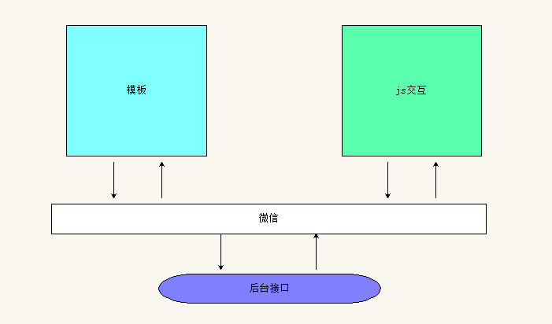

# 大纲
- js交互逻辑
- 熟悉小程序API作用
- 熟悉默认创建的小程序主页面用户信息获取流程
- 熟悉默认创建的小程序日志页面业务流程
- 熟悉本地存储、界面、后台接口调用API用法
- 熟悉图片选取与文件上传API用法
- 能够实现颜值测试案例效果

## JS交互逻辑详解
- js和wxml交互流程分析
    - js与模板是如何交互的？

- App() 该函数是微信小程序api的一部分，App名称是固定的
    + getApp() 作用：在子页面中使用全局实例对象中的数据和方法
      + 不可以显示的调用全局生命周期函数
      + 但是可以直接操作自定义的数据或者函数
    + 这app.js中通过this的方式获取小程序实例
- Page() 该函数是微信小程序api的一部分，Page名称是固定的
    + 页面数据 data
    + 生命周期函数
    + 事件处理函数
    + setData 函数用于将数据从逻辑层发送到视图层（异步），同时改变对应的 this.data 的值（同步）。
      + data数据变更时同步的：就是调用完成setData之后，可以直接在后面获取到最新值
      + 视图层更新是异步的：调用完成setData之后，页面有可能还没有更新，必须setData回调函数触发的时候才更新。
- 模块化js（CommonJS规范）
    - 模块成员导出 
        - module.expors 
        - exports
        - 组好两者不要结合使用
    - 模块成员导入 require()
- ES6的模块化
    - 导出export
    - 导入import

## 微信小程序API详解
> 小程序开发框架提供丰富的微信原生 API，可以方便的调起微信提供的能力，如获取用户信息，本地存储，支付功能等。

- 根据api的名称大体可以分为如下三类
    + 事件监听 API
    + 同步 API 
    + 异步 API 
- 常用API
    + 界面API：加载提示
      + wx.showLoading
      + wx.hideLoading
    + 调用后台接口
      + wx.request

## 默认小程序案例详解

- 如何获取用户的微信信息
  - 默认小程序页面需要提供一个按钮
  - 该按钮需要用户点击从而获取个人的头像和昵称
    - 需要配置open-type="getUserInfo" （指定该属性和值，那么点击的时候会弹窗提示用户授权）
    - 还需要指定事件处理函数bindgetuserinfo="getUserInfo"（如果用户点击了允许，那么就调用该属性指定的回调函数，回调函数的名称是自定义的）

- wx api
  - wx.canIUse('button.open-type.getUserInfo') 判断是否当前版本可用
  - wx.getUserInfo() 获取用户信息（头像和昵称）
  - wx.navigateTo() 跳转页面
  - wx.getStorageSync() 同步获取本地存储中的数据
  - wx.setStorageSync() 保存数据到本地存储中
  - wx.getSetting() 获取用户的授权信息，但是不包含具体数据
  - res.authSetting 判断用户是否已经进行授权操作

## 案例:颜值测试
- [腾讯AI](https://ai.qq.com/)
    + 技术引擎->人脸检测与分析
    + 测试接口https://ai.qq.com/cgi-bin/appdemo_detectface
- chooseImage() 选择图片或者调用摄像头
    + sizeType
    + sourceType
    + success
    + const image = res.tempFiles[0]
    + image.size
    + image.path
- wx.uploadFile()
    + url  图片上传地址
    + filePath  本地图片的路径
    + name  提供给服务器的图片的获取名称
    + success  上传成功的回调函数
    + result.data.face[0]  表示服务器返回数据
- onShareAppMessage() 分享功能

## 自定义组件
- json文件中配置
    + "component": true
- js文件中 
    + properties组件属性
    + data组件内部数据
    + methods组件内部方法
- wxss组件样式
- wxml组件模板
    + <slot></slot>

## WXS
> WXS 与 JavaScript 是不同的语言，有自己的语法，并不和 JavaScript 一致。

- wxs模块
- 注释
- 变量
- 数据类型
- 运算符
- 语句
- 基础类库

## 尺寸单位rpx
> rpx（responsive pixel）: 可以根据屏幕宽度进行自适应。规定屏幕宽为750rpx。如在 iPhone6 上，屏幕宽度为375px，共有750个物理像素，则750rpx = 375px = 750物理像素，1rpx = 0.5px = 1物理像素。

设备 | rpx换算px (屏幕宽度/750) | px换算rpx (750/屏幕宽度)
---  |---  |---
iPhone5 | 1rpx = 0.42px | 1px = 2.34rpx
iPhone6 | 1rpx = 0.5px  | 1px = 2rpx
iPhone6 Plus | 1rpx = 0.552px | 1px = 1.81rpx

