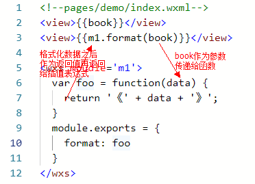

# 大纲

## 反馈

- wxs 脚本语言，可以理解为js的补充
 
- focus 光标自动定位
- 自定义组件插槽用法

## 项目开发基础

### 项目开发流程

- 全新的项目
  - 创业公司
  - 公司的新的业务线
- 既有的项目
  - 已经上线，需要修改一些bug
  - 已经上线，需要做二期新的需求（能通过添加代码完成的工作，尽量不要修改原有代码）
  - 已经有的项目需要重构（jQuery -> Vue）
- 立项->需求分析->设计->开发->测试->上线->运维

### 项目团队组成

- 项目经理
- 产品经理->产品原型Axure->有交互效果的页面（不考虑美观；考虑业务）
- UI/UE/UED->psd（重点考虑美观）
- 前端：psd->静态页面（html/css/js）;负责前端代码层面业务开发和后退接口交互
- 后端：主要提供接口URL（后端的话语权较大）
- 测试
- 运维
- 架构师
- DBA（大厂）
- 全栈工程师
- 移动端开发：IOS；Android

- 项目技术选型
  - 项目负责人负责选型：技术选型时根据项目业务类型来定的
  - 小程序技术选型：原生语法，小程序框架mpvue、wepy


## 小程序开发框架mpvue

### mpvue介绍

> mpvue 是一个使用 Vue.js 开发小程序的前端框架。[【官网】](http://mpvue.com/)

- 主要特性
  - 完整的 `Vue.js` 开发体验
  - 快捷的 `webpack` 构建机制：自定义构建策略、开发阶段 hotReload
  - 支持使用 npm 外部依赖
  - 使用 `Vue.js` 命令行工具 vue-cli 快速初始化项目

### mpvue基本使用

- 安装Node.js(版本号大于v8.9.0)

- 安装vue脚手架
    + npm install --global vue-cli@2.9 
- 初始化项目（最后的项目名称自定义）
    + vue init mpvue/mpvue-quickstart my-project
- 安装依赖包（进入到项目的目录中进行）
    + npm install
- 运行项目
    + npm run dev
- 项目要导入到小程序开发工具中，但是代码通过vscode或者sublime进行开发

### mpvue项目结构概述

- 项目整体结构
  - src 项目源代码
    - pages 小程序的页面
    - components 通用的一些组件
    - utils 中用来放置一些通用的工具方法
    - main.js是入口js文件
    - App.vue是入口的组件文件
    - app.json是全局配置文件
  - dist 项目源代码编译之后生成的小程序代码（其实真正可以运行的代码就是这里的代码）
  - static 提供一些静态资源：比如图片
  - build和config都是webpack配置文件
  - index.html 这是项目唯一的页面

### mpvue案例实践

- 基于mpvue框架的Tab案例
  - 实现基本布局

  - 实现切换操作

    - 先提供数据

    ```
          listData: [{
            id: 1,
            title: 'apple',
            content: '苹果'
          }, {
            id: 2,
            title: 'orange',
            content: '橘子'
          }, {
            id: 3,
            title: 'banana',
            content: '香蕉'
          }]
    ```

    - 把数据动态填充到模板中
    - 修改数据，选项卡会自动变化

```
  <div class="tab">
      <button @click='handle(index)' :key='item.id' v-for='(item, index) in listData'>
        {{item.title}}
      </button>
      <div :class="{active: currentIndex == index}" :key='item.id' v-for='(item, index) in listData'>
        {{item.content}}
      </div>
  </div>
```

```
clickHandle (id) {
  // 切换操作需要修改currentIndex即可
  this.currentIndex = id
}
```

## 项目业务概述

### 电商业务

- PC端
- 移动Web
- 小程序
- APP

### 功能模块

- 主页
  - 商品搜索
  - 搜索历史
  - 商品列表
  - 商品详情
  - 添加购物车
- 分类商品
  - 分类查询
- 购物车
  - 生成订单
  - 支付
- 个人中心


## 项目初始化

- 通过vue脚手架初始化项目
- 通过git进行项目管理
  - git add
  - git commit 
  - git remote
  - git push 

## 主页功能

### 搜索栏

- 基本布局实现
- 通用组件抽取

```
// 导入组件
import SearchBar from '../../components/searchbar'
// 配置组件
exports default {
  components: {
    'search-bar': SearchBar
  }
}
// 使用组件
<template>
  <search-bar></search-bar>
</template>
```

### 轮播图

- 基于小程序swiper实现轮播图布局

```
<swiper>
  <swiper-item wx:for="{{imgUrls}}">
    <image src="{{item}}" class="slide-image" width="355" height="150" />
  </swiper-item>
</swiper>
```

```
// swiper数据
data: {
  imgUrls: [
    'https://images.unsplash.com/photo-1551334787-21e6bd3ab135?w=640',
    'https://images.unsplash.com/photo-1551214012-84f95e060dee?w=640',
    'https://images.unsplash.com/photo-1551446591-142875a901a1?w=640'
  ],
  indicatorDots: false, // 显示底部小圆点
  autoplay: false       // 自动播放
}
```

- 对接后台接口轮播图数据：接口地址参见【接口文档】

```
mpvue.request({
  url: 'https://www.zhengzhicheng.cn/api/public/v1/home/swiperdata',
  success: function (res) {
    let {message} = res.data
    that.swiper = message
  }
})
```

### 菜单

- 菜单基本布局
  - display: flex;

  -  justify-content: space-around;
- 对接菜单后台接口数据

```
mpvue.request({
  url: 'https://www.zhengzhicheng.cn/api/public/v1/home/catitems',
  success: function (res) {
    let {message} = res.data
    that.menu = message
  }
})
```

### 封装通用接口调用模块

```
// 封装一个通用的请求方法
const request = (path, method = 'GET', data = {}, header = {}) => {
  // 把异步的请求放到Promise实例中处理
  let url = `https://www.zhengzhicheng.cn/api/public/v1/${path}`
  let p = new Promise(function (resolve, reject) {
    mpvue.request({
      url,
      method,
      data,
      header,
      success: function (res) {
        resolve(res)
      }
    })
  })
  return p
}
export default request
```

- 重构轮播图和菜单的数据接口调用方式

```
async swiperData () {
  this.swiper = await this.queryData('home/swiperdata')
}
```

### 商品列表

- 商品列表布局

```
<div class="floor" >
  <div class="floor-title">
    
  </div> 
  <div class="floor-content">
    <div class="left">
      
    </div>
    <div class="right">
      
      
      
      
    </div>
  </div>
</div>
```

```
.floor{
  .floor-title{
    width:100%;
  }
  .floor-content{
    display: flex;
    justify-content: space-between;
    width:100%;
    .left {
      img {
        width:232rpx;
        height:385rpx;
      }
    }
    .right {
      flex:1;
      display: flex;
      justify-content: space-between;
      flex-wrap: wrap;
      img {
        width:232rpx;
        height:188rpx;
        border-radius:4px;
      }
    }
  }
}

```

- 对接商品接口数据

```
async floorData () {
  this.floor = await this.queryData('home/floordata')
}
```

### 回到顶部

- 按钮样式
- 回到顶部功能实现

```
toTopHandle () {
  // 控制回到顶部
  mpvue.pageScrollTo({
    scrollTop: 0
  })
}
```

```
onPageScroll (event) {
  // 小程序生命周期函数，监控页面的滚动
  // 如果滚动指定大小，那么就控制显示或隐藏
  this.isShow = event.scrollTop > 50
}
```

### 下拉刷新

- 配置下拉刷新选项
- 实现下拉刷新功能

```
onPullDownRefresh () {
  // 下拉刷新，重新加载页面的数据
  this.initData()
}
```

### 配置sass环境

- 安装相关依赖包

```
npm install node-sass sass-loader -D
```

- 样式标签配置scss

```
<style scoped lang='scss'>
  @import 'main.scss'
</style>
```

